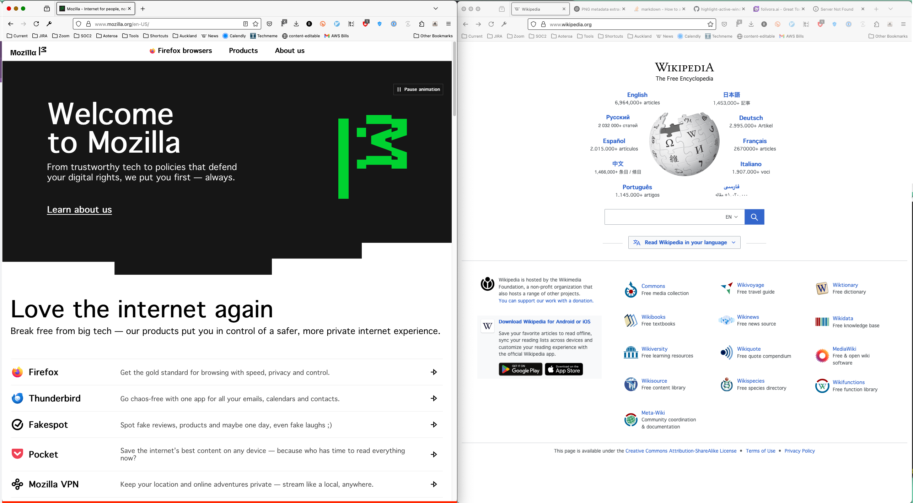

# highlight-active-window
A simple Hammerspoon module that draws a red line below the active window so that it is easy to identify the current active window visually. 

As macOS uses subtle cues to highlight the active window, it is not always visually apparent what the active window is at the moment. Notice the red line on the bottom border of one of the left window. This module makes the subtle overt.

